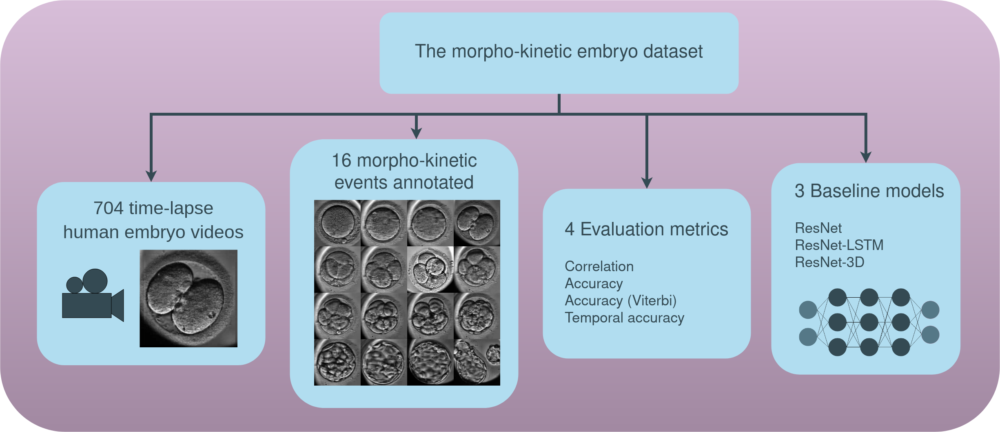

# A large public benchmark  for morphokinetic parameter prediction

This is the official repository of the paper : "Paving the way for deep learning-powered IVF : A large public benchmark for morphokinetic parameter prediction".



## Data 

First, download the files 'embryo_dataset.tar.gz' and 'embryo_dataset_annotations.tar.gz' from https://doi.org/10.5281/zenodo.6390798

Then, extract the content of these files in the "data" folder.

## Training models 

To train the ResNet, ResNet-LSTM and ResNet-3D, use the following script : 

```
./run_cross_validation.sh $SPLIT
```

Where $SPLIT is the split index (going from 0 to 4).
This will sucessively train and test the three baseline models on the split chosen.

To compute the metrics use the following script : 

```
python3 processResults.py --exp_id cross_validation --model_ids resnet_split$SPLIT resnet-lstm_split$SPLIT resnet3D_split$SPLIT
```

This will write the metrics in a csv file here : 

```
../results/cross_validation/metrics.csv
```